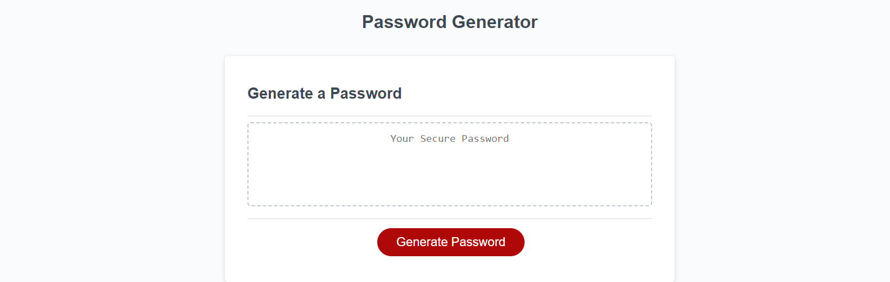

# Password Generator

## Description

I was tasked with adding JavaScript code to make this password generator functionable.

## Installation

I used arrays and if functions to let the browser collect user input via prompts and generate a password that is randomized and pertaining to the correct input.

## Usage

To use this page, you click "Generate Password" and it will ask you series of questions. You will then select how many characters you would like, then if you would like to include special characters, then numeric characters, then lowercase letters, and then uppercase characters. Then a randomized password will generate with the exact perameters you have selected. OK means yes and cancel means no. If you do not select a character limit, it informs you that you need to and restarts. If you choose a limit that is not between 8 and 128, it will inform you to do it again. If you choose a limit but no choices, it will inform you to do so and clear the field. Once you have successfully generated a random password, a countdown appears showing that the new password will delete after 10 seconds.

## Credits

HTML, CSS, and starter JavaScript code were provided by my bootcamp instructors and most of the JavaScript code was written from scratch through trial and error, some looking back at activities done in class, and searching via Google.

https://mrmessyface.github.io/password-generator/