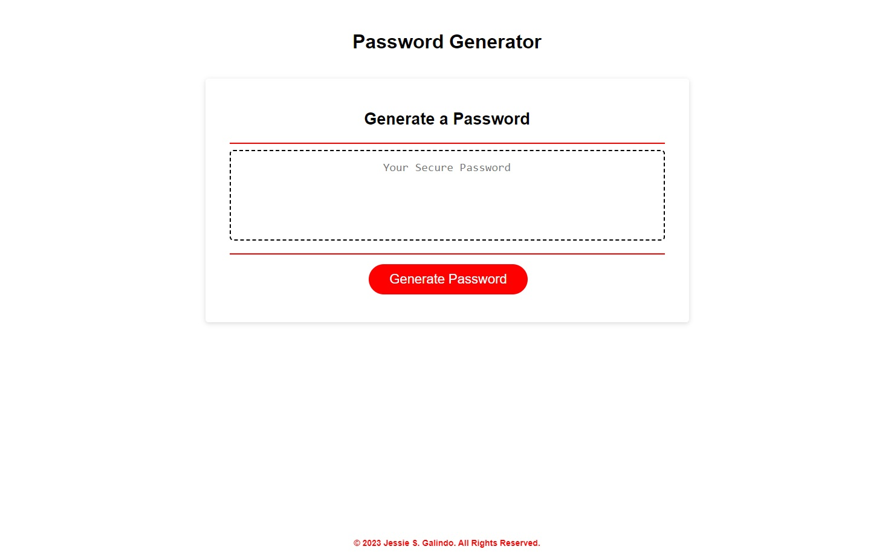

# Password Generator

## Description

I was tasked with creating a functioning password generator using JavaScript. I used arrays and if functions to let the browser collect user input via prompts and generate a password that is randomized and pertaining to the correct input. I added a countdown timer that counts down until the generated password is deleted so that nobody else can see the password that was generated.

## Installation

No installation necessary but you can clone the [repository](https://github.com/MrMessyFace/password-generator) from GitHub to edit it and make your own version.

## Usage

To use this page, you click "Generate Password" and it will ask you series of questions. You will select how many characters you would like, if you would like to include special characters, numeric characters, lowercase letters, and/or uppercase characters. Then a randomized password will generate with the exact perameters you have selected. OK means yes and cancel means no. If you do not select a character limit, it informs you that you need to and restarts. If you choose a limit that is not between 8 and 128, it will inform you to do it again. If you choose a limit but no choices, it will inform you to do so and clear the field. Once you have successfully generated a random password, a countdown appears showing that the new password will delete after 10 seconds.

## Credits

HTML, CSS, and starter JavaScript code were provided by the Northwestern University Full Stack Coding Bootcamp and most of the JavaScript code was written from scratch, referencing class curriculum.

## Helpful Links

- [Repository](https://github.com/MrMessyFace/password-generator)
- [Live App](https://mrmessyface.github.io/password-generator/)

&copy; 2023 Jessie S. Galindo. All Rights Reserved.
